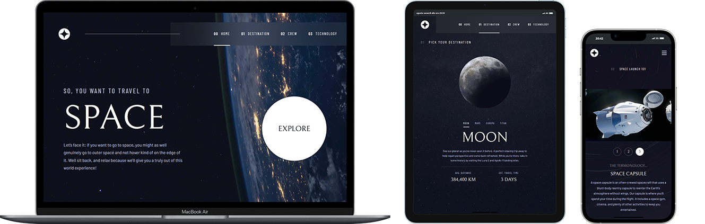

# Space Tourism



## Live Preview

Visualizza una live preview del sito al seguente link: [Space Tourism](https://space-tourism-three-chi.vercel.app/)

## Descrizione

Questo progetto è un sito web di turismo spaziale sviluppato con Next.js e Tailwind CSS. Il sito offre un'esperienza interattiva che permette agli utenti di esplorare diverse destinazioni spaziali, conoscere i membri dell'equipaggio e scoprire le tecnologie utilizzate. La navigazione è intuitiva e il design è stato curato per essere accattivante e moderno, garantendo una completa immersività.

## Installazione

Per installare e avviare il progetto in locale, segui questi semplici passaggi:

1. **Clona il repository:**

   ```bash
   git clone https://github.com/tuo-username/space-tourism.git
   ```

2. **Installa le dipendenze:**

   ```bash
   npm install
   ```

3. **Avvia il server di sviluppo:**
   ```bash
   npm run dev
   ```

Apri [http://localhost:3000](http://localhost:3000) nel tuo browser per vedere il risultato.
